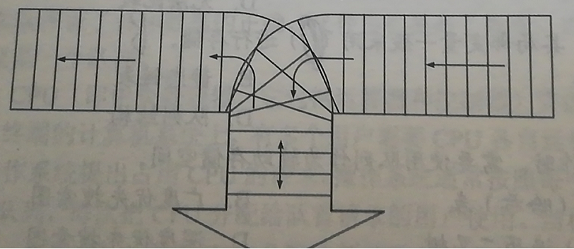

[TOC]


### 一、 栈（没有大题）

### 二、 队列

1. 若希望循环队列中的元素都能得到利用，则需设置一个标志域tag，并以tag的值为0或1来区分队头指针front和队尾指针rear相同时的队列状态是空还是满。试编写次结构相应的入队和出队算法。

   ```c
   //入队算法
   bool enqueue(Queue *q,int x){
       if(q->front == q->rear && tag == 1){
           //队满返回
           return false;
       }
       q->data[q->rear] = x;
       q->rear = (q->rear+1)%MAX_SIZE;
       tag = 1;
       return true;
   }
   //出队算法
   bool dequeue(Queue *q,int *a){
       if(q->front == q->rear && tag == 0){
           //队列空返回
           return false;
       }
       *a = q->data[q->front];
       q->front = (q->front+1)%MAX_SIZE;
       tag = 0;
       return true;
   }
   ```

   

2. Q是一个队列，S是一个空战，实现将队列中的元素逆置的算法。

   ```c
   void reverse(Queue *q,Stackk *s){
       while(!isEmpty(q)){
           int *tmp;
           dequeue(q,tmp);
           s.push(*tmp);
       }
       while(!isEmpty(s)){
           enqueue(q,s.pop());
       }
   }
   ```

   

3. 利用两个栈S1、S2来模拟一个队列，已知栈的4个运算定义如下：

   ```
   Push(S,x)			//元素x入栈
   Pop(S,x)			//s出栈并将出栈的值赋给x
   StackEmpty(S);		//判断栈是否为空
   StackOverflow(S);	//判断栈是否满
   ```

   如何利用栈的运算来实现该队列的三个运算？（形参有读者根据要求自己设计）

   ```c
   //将元素x入队
   bool Enqueue(Stack *S1,int x){
       if(StackOverflow(S1)){
           return false;
       }
       Push(S1,x);
       return true;
   }
   //出队，并将出队元素存储在x中
   bool Dequeue(Stack *S1,Stack *S2,int *x){
       if(StackEmpty(S1)){
           return false;
       }
       bool flag = false;
       int *tmp;
       //将S1放到S2中
       while(StackEmpty(S1)){
           Pop(S1,tmp);
           if(StackOverflow(S2)){
               flag=true;
               break;
           }
           Push(S2,*tmp);
       }
       int *tmp2;
       if(flag){
           //表示S2栈满无法导出数据
           //直接放回数据，队列死了
           while(StackEmpty(S2)){
               Pop(S2,tmp2);
               Push(S1,*tmp2);
           }
           return false;
       }else{
           Pop(S2,x);
           while(StackEmpty(S2)){
               Pop(S2,tmp2);
               Push(S1,*tmp2);
           }
           return true;
       }
   }
   
   //判断队列是否为空
   bool QueueEmpty(Stack *S1){
       return StackEmpty(S1);
   }
   ```

### 三、 应用

1. 假设一个算法表达式中包含圆括号、方括号和花括号3中类型的括号，编写一个算法来判别表达式中的括号是否配对，以字符 '\0' 作为算术表达式的结束符

   ```c
   bool matchBracket(char *s){
       Stack *st;
       InitStack(st);
       int i=0;
       while(s[i]!='\0'){
           switch(s[i]){
               case '(':
               case '[':
               case '{':
                   push(st,s[i]);
                   break;
               case ')':
                   if(pop(st)!='('){
                       return false;
                   }
                   break;
               case ']':
                   if(pop(st)!='['){
                       return false;
                   }
                   break;
               case '}':
                   if(pop(st)!='{'){
                       return false;
                   }
                   break;
           }
           i++;
       }
       if(IsEmpty(st)){
           return true;
       }
       return false;
   }
   ```

   

2. 按下图所示铁道进行车厢调度（注意，两侧铁道均为单向行驶道，火车调度站有一个用于调度的“栈道”），火车调度站的入口处有n节硬座和软座车厢（分别用H和S表示）等待调度，试编写算法，输出对着n节车厢进行调度的操作（即入栈或出栈操作）序列，以使所有的软座车厢都调整到硬座车厢之前。

   

   ```c
   char *change(char *l){
       int stack=0;
       //i表示入栈，o表示出栈，\0结尾
       char *result;
       int i=0;
       while(l[i]!='\0'){
           i++;
       }
       result = (char *)malloc(sizeof(char)*(i+1)*2);
       result[(i+1)*2-1]='\0';
       i=0;
       int j=0;
       while(l[i]!='\0'){
           if(l[i]=="H"){
               //硬座保留在栈中
               stack++;
               result[j++]='i';
           }else{
               result[j++]='i';
               result[j++]='o';
           }
       }
       while(stack!=0){
           result[j++]='o';
           stack--;
       }
   }
   ```

   

3. 利用一个栈实现以下递归函数的非递归计算。
   $$
   P_{n}\left ( x \right )=\begin{cases}1, &n=0 \cr 2x, &n=1 \cr 2xP_{n-1}\left ( x \right ) - 2\left ( n-1 \right )P_{n-2}\left ( x \right ), &n>1\end{cases}
   $$
   

   ```c
   int P(int x,int n){
       if(n==0){
           return 1;
       }else if(n==1){
           return 2*x;
       }
       return 2*x*p(x,n-1)-2*(n-1)*p(x,n-2);
   }
   ```

   