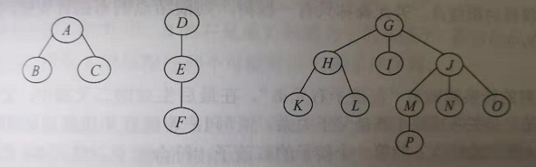
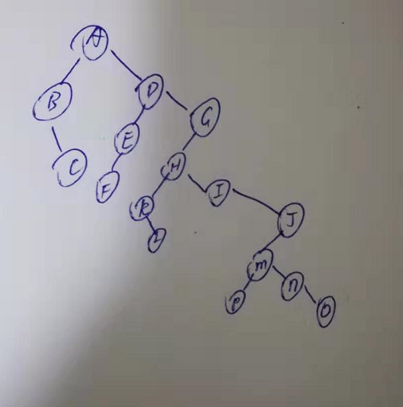
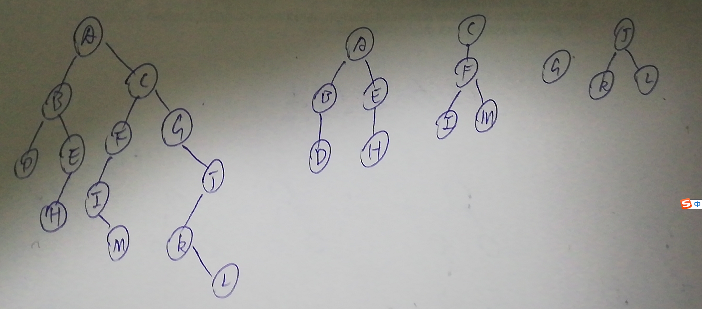

1. 给定一棵树的先根遍历序列和后根遍历序列，能否唯一确定一棵树？若能，请举例说明；若不能，请给出反例

   ```c
   可以，因为一棵树的后根遍历序列就是这棵树对应的二叉树的中序遍历，先根遍历就是对应二叉树的先序遍历，二叉树的中序遍历和先序遍历可以确定一棵二叉树，所以该树能够被确定。
   ```

   

2. 将下面一个有三棵树组成的森林转换为二叉树。

   

   

3. 已知某二叉树的先序序列和中序序列分别为ABDEHCFIMGJKL 和 DBHEAIMFCGKLJ 请画出这个二叉树与其对应的森林

   

4. 若一棵非空k(k>=2)叉树T中的每个非叶结点都有k个孩子，则称T为正则k叉树。请回答下列问题并给出推导过程。

   * 若T有m个非叶结点，则T中的叶结点有多少个？

     ```
     设叶结点x个,结点数等于连接数+1
     x+m=km+1
     所以x=(k-1)m+1
     ```

     

   * 若T的高度为h（单结点的树h=1），则T的结点数最多为多少个？最少为多少个？

     最多：$M1=\frac{k^{h}-1}{k-1}$

     最少：$M2=1+(h-1)k$

     

5. 编程求以孩子兄弟表示法存储的森林的叶子结点数。

   ```c
   int i=0;
   void func(BiNode *t){
       if(t==null){
           return;
       }
       if(func->lchild==null){
           i++;
       }
       func(t->lchild);
       func(t->rchild);
   }
   ```

   

6. 以孩子兄弟链表为存储结构，请设计递归算法求树的深度。

   ```c
   int func(BiNode *t){
       if(t==null){
           return 0;
       }
       int hc=func(t->lchild);
       int hs=func(t->rchild);
       if(hc+1>hs)
           return hc+1;
       else
       	return hs; 
   }
   ```

   