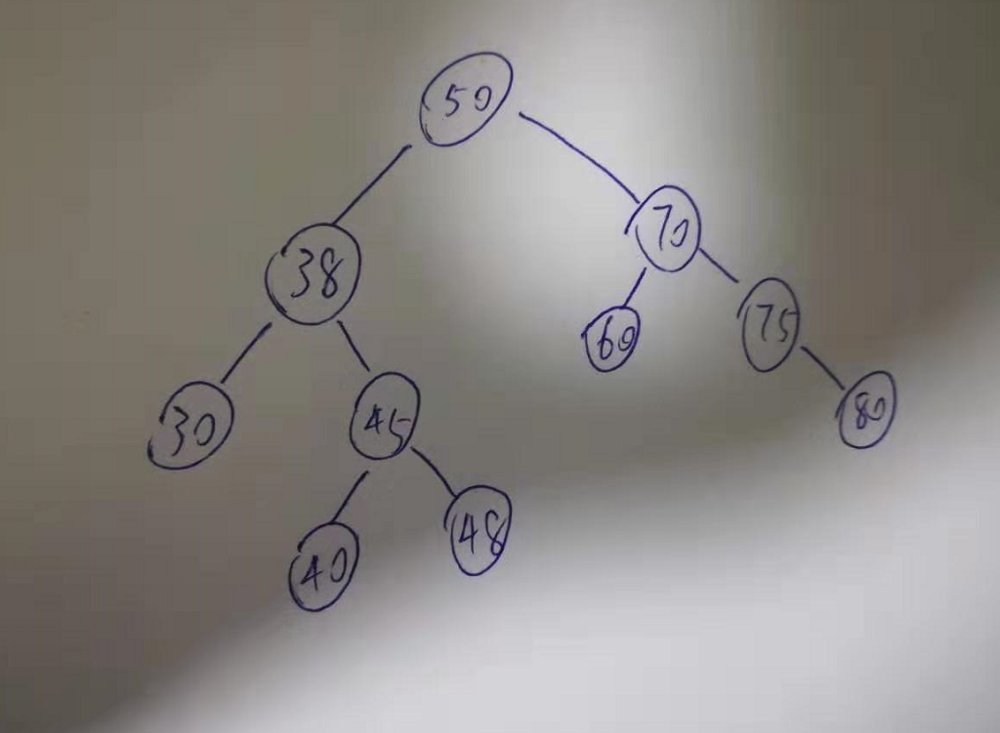
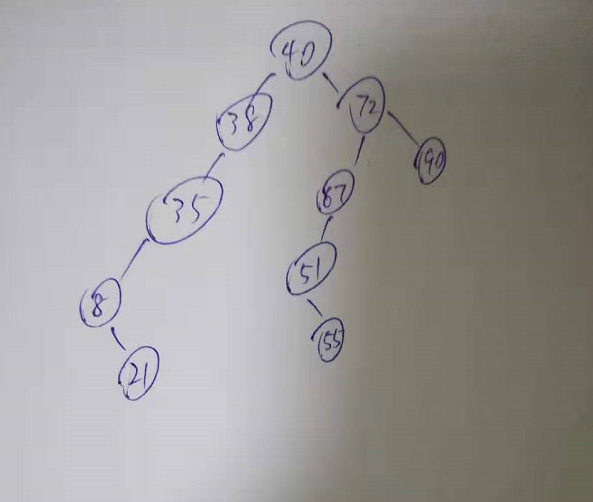
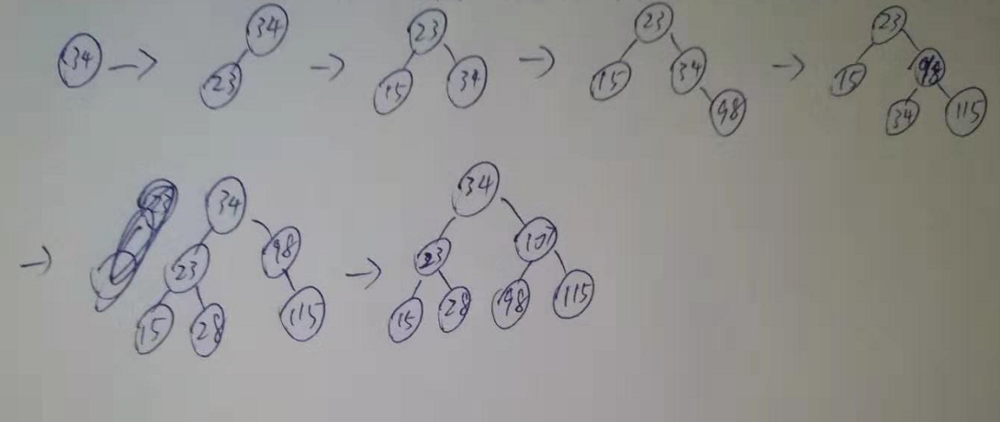

1. 一棵二叉排序树按先序遍历得到的序列为(50,38,30,45,40,48,70,60,75,80),试画出该平衡二叉树，并求出等概率下查找成功和查找失败的平均查找长度。

   

   ```
   查找成功长度=2.9
   失败长度=39/11
   ```

   

2. 按照序列(40,72,38,35,47,51,90,8,55,21)建立一棵二叉排序树，画出该树，并求出在等概率情况下，查找成功的平均查找长度。

   

   ```
   asl=(1+2*2+3*3+4*2+5*2)/10=3.2
   ```

   

3. 依次把节点(34,23,15,98,115,28,107)插入初始状态为空的平衡二叉排序树，使得在每次插入后保持该树仍是平衡二叉树，请依次画出每次插入后形成的平衡二叉排序树。

   

4. 给定一个关键字集合{25,18,34,9,14,27,42,51,38},假定查找各个关键字的概率相同，请画出其最佳的二叉排序树。

   ```mermaid
   graph TD
   A[27]-->B[14]
   A-->C[38]
   B-->D[9]
   B-->E[18]
   E-->|右子树|H[25]
   C-->F[34]
   C-->G[42]
   G-->|右子树|I[51]
   ```

   

5. 画出一个二叉树，使得它既满足大根堆的要求，又满足二叉排序树的要求。

   ```mermaid
   graph TD
   A[10]-->|左子树|B[5]
   ```

   

6. 试编写一个算法，判断给定的二叉树是否是二叉排序树。

   ```c
   bool func(BiNode *p){
       if(p==null){
           return true;
       }
       if(p->lchild!=null && p->rchild!=null){
           if(p->lchild->data<p->data && p->rchild->data>p->data){
               return func(p->lchild) && func(p->rchild);
           }
           return false;
       }else if(p->lchild!=null && p->rchild==null){
           if(p->lchild->data<p->data){
               return func(p->lchild);
           }
           return false;
       }else if(p->lchild==null && p->rchild!=null){
           if(p->rchild->data>p->data){
               return func(p->rchild);
           }
           return false;
       }else{
           return true;
       }
   }
   ```

   

7. 设计一个算法，求出指定节点在给定二叉排序树中的层次。

   ```c
   int level(BiNode *p,int x){
       BiNode *tmp=p;
       int i=1;
       while(tmp->data!=x && tmp!=null){
           i++;
           if(tmp->data>x){
               tmp = tmp->lchild;
           }else{
               tmp = tmp->rchild;
           }
       }
       if(tmp==null){
           return -1;
       }else{
           return i;
       }
   }
   ```

   

8. 利用二叉树遍历的思想编写一个判断二叉树是否是平衡二叉树的算法。

   ```c
   //返回层高
   int balance(BiNode *p,bool *flag){
       bool innerFlag1,innerFlag2;
       if(p==null){
           flag=true;
           return 0;
       }
       int l = balance(p->lchild,innerFlag1);
       int r = balance(p->rchild,innerFlag2);
       if(!innerFlag1 || !innerFlag2){
           flag==false;
           return Math.max(l,r)+1;
       }
       flag = !Math.abs(l-r)>1;
       return Math.max(l,r)+1;
   }
   ```

   

9. 设计一个算法，求出给定二叉排序树中最小和最大的关键字

   ```c
   void maxAndMin(BiNode *p,int *max,int *min){
       BiNode *tmp=p;
       while(tmp->lchild!=null){
           max = tmp->data;
           tmp = tmp->lchild;
       }
       tmp=p;
       while(tmp->rchild!=null){
           min = tmp->data;
           tmp = tmp->rchild;
       }
   }
   ```

   

10. 设计一个算法，从大到小输出二叉排序树中所有值不小于k的关键字。

    ```c
    void func1(BiNode *p,int k){
        if(p==null){
            return;
        }
        if(p<=k){
            return;
        }
        func1(p->rchild);
        printf("%d",p->data);
        func1(p->lchild);
    }
    ```

    

11. 设给定权集w={5,7,2,3,6,8,9},试构造关于w的一棵哈夫曼树，并求其加权路径WPL。

    ```mermaid
    graph TD
    a-->b
    a-->c
    b-->d
    b-->e
    c-->f[8]
    c-->g[9]
    d-->h
    d-->i[5]
    e-->j[6]
    e-->k[7]
    h-->l[2]
    h-->m[3]
    ```
    
    ```
    WPL = 4*(2+3)+3*(5+6+7)+2*(8+9)=108
    ```
    
12. 编写一个递归算法，在一棵有n个节点的，随机建立起来的二叉排序树上查找第k(1<=k<=n)小的元素，并返回指向该节点的指针。要求算法的平均时间复杂度为O(log2n)。二叉排序树的每个结点中除data，lchild,rchild等数据成员外，增加一个count成员，保存以该节点为根的子树上的结点个数。

    ```c
    Node *findNoK(BiNode *p,int k){
        BiNode *tmp=p;
        if(k==p->count){
            while(tmp->rchild!=null){
                tmp = tmp->rchild;
            }
            return tmp;
        }
        if(k>p->lchild->count){
            tmp = findNok(p->rchild,k-p->lchild->count);
        }else{
            tmp = findNok(p->lchild,k);
        }
        return f;
    }
    ```

    

13. 设有6个有序表A,B,C,D,E,F, 分别含有10、35、40、50、60和200个数据元素，各表中的元素按升序排列。要求通过5次两两合并，将6个表最终合并为一个升序表，并使最坏情况下比较的总次数达到最小。请回答下列问题。

    1. 给出完整的合并过程，并求出最坏情况下比较的总次数。

    2. 根据你的合并过程，描述n(n>=2)个不等长升序表的合并策略，并说明理由。

       利用哈夫曼树，每次合并最短的两个表。

