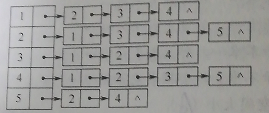

1. 已知带权有向图G的邻接矩阵如下图所示，请画出该带权有向图G

   |  a   |  b   |  c   |  d   |  e   |  f   |  g   |
   | :--: | :--: | :--: | :--: | :--: | :--: | :--: |
   |  0   |  15  |  2   |  12  |  ∞   |  ∞   |  ∞   |
   |  ∞   |  0   |  ∞   |  ∞   |  6   |  ∞   |  ∞   |
   |  ∞   |  ∞   |  0   |  ∞   |  8   |  4   |  ∞   |
   |  ∞   |  ∞   |  ∞   |  0   |  ∞   |  ∞   |  3   |
   |  ∞   |  ∞   |  ∞   |  ∞   |  0   |  ∞   |  9   |
   |  ∞   |  ∞   |  ∞   |  5   |  ∞   |  0   |  10  |
   |  ∞   |  4   |  ∞   |  ∞   |  ∞   |  ∞   |  0   |

   ```mermaid
   graph LR
   a-->|15|b
   a-->|2|c
   a-->|12|d
   b-->|6|e
   c-->|8|e
   c-->|4|f
   d-->|3|g
   e-->|9|g
   f-->|5|d
   f-->|10|g
   g-->|4|b
   ```

   

2. 设图G=(v,e)以邻接表存储，如下图所示。画出其邻接矩阵存储及图G。

   

   |  1   |  2   |  3   |  4   |  5   |
   | :--: | :--: | :--: | :--: | :--: |
   |  0   |  1   |  1   |  1   |  0   |
   |  1   |  0   |  1   |  1   |  1   |
   |  1   |  1   |  0   |  1   |  0   |
   |  1   |  1   |  1   |  0   |  1   |
   |  0   |  1   |  0   |  1   |  0   |

   

3. 对n个顶点的无向图和 有向图，分别采用邻接矩阵和邻接表表示时，试问：

   1. 如何判断图中有多少条边

      ```
      无向图中，邻接矩阵中等于1的数量/2
      有向图中，等于边表节点
      ```

      

   2. 如何判别任意两个顶点i和j是否有边相连

      ```
      无向图中：看A[i][j] 值是否为1
      有向图中：看第i个行节点的边节点中是否有j节点和看第个j行节点的边节点中是否有i节点
      ```

4. 写出从图的邻接表表示转换成邻接矩阵表示的算法。

   ```c
   void convert(ALGraph *G,int arcs[M][N]){
       for(i=0;i<n;i++){
           p=(G->v[i]).firstarc;
           while(p!=null){
               arcs[i][p->data]=1;
               p=p->nextarc;
           }
       }
   }
   ```

   

